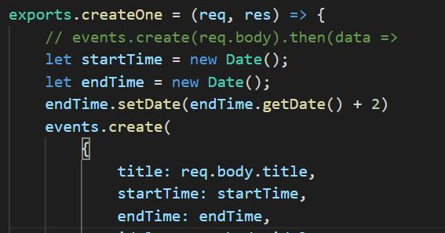
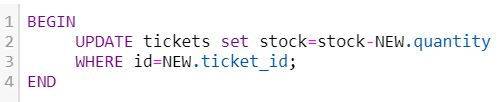
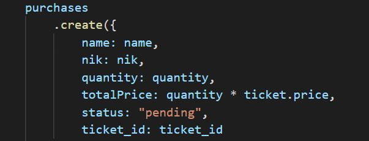
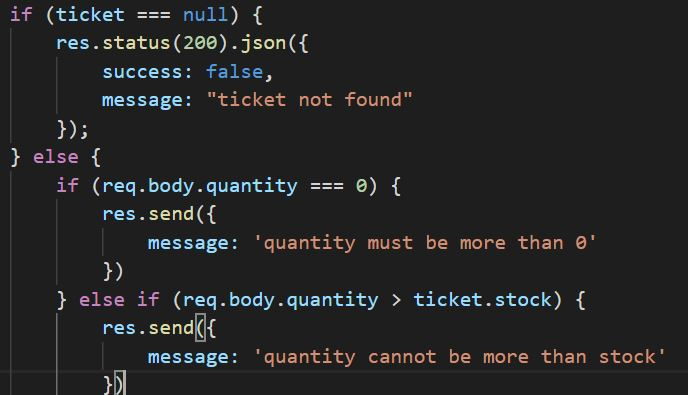

# setDate
setDate saya gunakan untuk mengatur tanggal agar otomatis dapat tersimpan tanpa harus input manual. Dimana dalam project ini saya membuat startTime sebagai new Date(), dalam artian new Date() adalah tanggal yang berlaku saat kita melakukan input data. Dan untuk bagian endTime saya membuat parameter dimana endTime = startTime + 2. Artinya selisih ataupun jarak antara startTime dan event adalaha 2 hari.

# trigger
trigger saya gunakan dalam database db_gorry pada tabel purchases, dimana trigger ini bertujuan untuk melakukan perhitungan otomatis pada stock ticket yang tersedia. Dimana stock menampilkan seluruh jumlah stok ticket yang  tersedia, untuk stock sendiri akan berkurang jika ada customer yang membeli ticket berdasarkan id tertentu. Untuk stock akan terus berkurang berdasarkan quantity ticket yang dibeli dalam tabel purchases.

# status :"pending"
status pending saya gunakan saat customer sudah melakukan pembayaran  dan belum melakukan konfirmasi pada penjual. Pada bagian totalPrice saya juga sudah membuat perhitungan otomatis dimana total harga yang dibayar pada id tertentu adalah quantity(jumlah beli)  x  price(harga ticket), sehingga customer tidak perlu lagi menginputkan totalPrice secara manual.

# moreThan
fungsi ini dibuat sebagai parameter, jika pembelli membeli tiket melebihi quota yang tersedia maka pembelian ticket gagal. Namun jika pembelian <= qouta yang tersedia maka pembelian terebut adalah berhasil(success).